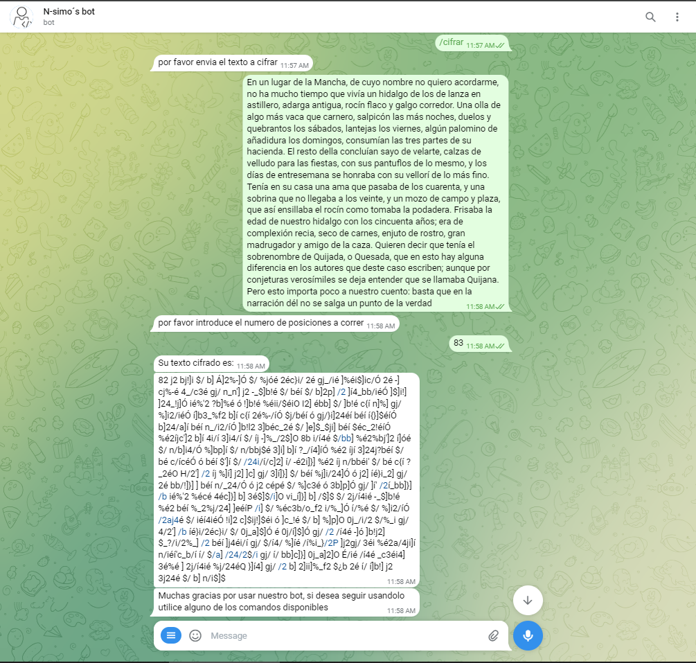
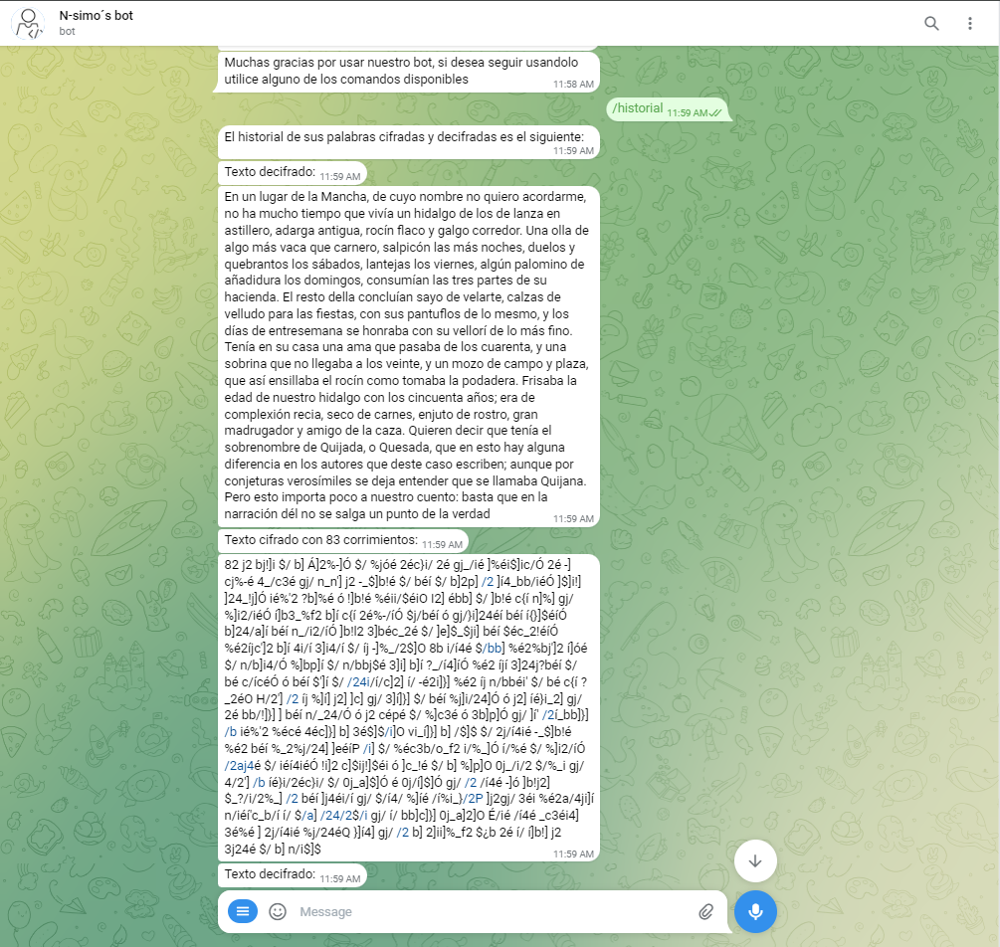

# Bot telegram con cifrado César

*Por favor tener en cuenta que el resultado de el bot esta disponible en el siguiente link: [Telegram: Nsimos_bot](https://t.me/Nsimos_bot)*

###### Bienvenido al bot de telegram para realizar cifrados César donde vas a poder encontrar todo lo necesario para estas operaciones

* Podras cifrar cualquier texto con el metodo César el cual solo debes darle tu numero de corrimientos y obtendras automaticamente el resultado en tu pantalla. Para ejecutar esta opción solo debes escribir `/cifrar`
* Podras descifrar cualquier texto que este cifrado en idioma español. Lo mejor de todo es que no necesitas proporcionar un numero de corrimiento, el sistema lo hará por ti. No importa la longitud ni los corrimientos, solo asegurate que el texto original esté escrito en español. Para la ejecución de este proceso solo debes escribir `/descifrar`
* ¡Tambien contamos con un historial! Para acceder a todos aquellos textos que cifraste o descifraste solo debes escribir `/historial`
***
## Demostraciones
##### Cifrado

##### Descifrado

##### Historial

***
Creador: Nefer Medina

Por favor en caso de querer probar el ejemplo en funcionamiento recodar:
* Instale todas las dependencias
* Instale correctamente los diccionarios proporcionados dentro de la carpeta donde se encuentre su libreria enchant instalada y luego en `data\mingw64\share\enchant\hunspell` para el correcto funcionamiento
* Ejecute el codigo o ponerse en contacto conmigo para ejecutar el codigo y que pueda probarlo eventualmente
